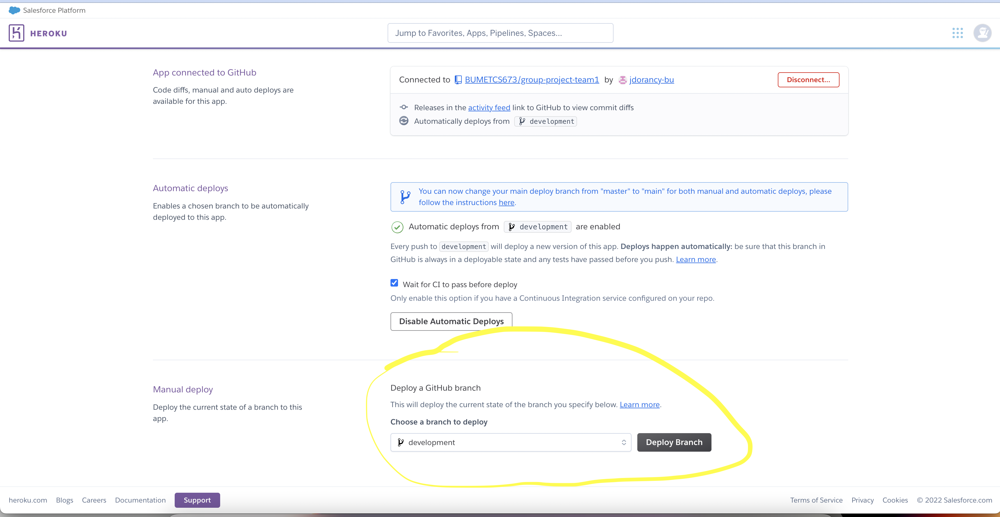

# Trackr

## Overview
Trackr is a simple app which allows users to track transaction against their bank account,
so they can better understand their spending behaviours. The application is built using
Spring Boot and React.

## Setup
Developers have to install the following software to configure their local environments.
Assume the latest version if none specified.
- Java SDK 1.8
- Maven
- Docker
- Postman
- IntelliJ IDE
- Lombok IntelliJ Plugin
- Heroku CLI
- Node
- NPM
- Webpack
- Webpack CLI
- Chrome Live Reload Extension

## Run with IDE
In order to run the application in IntelliJ IDE for the first time simply create a new run configuration
by right-clicking on the main method in the application class. For subsequent runs you simply click the run 
configuration created the first time. If you lose your configuration you can simply recreate it.


## Run in the Console
If you want to run the application in the console for experimenting then you first need
to build the application Uber JAR which will package all the dependencies. You use the following
Java command and specifying the previously built application Uber JAR as follows.

### Build
You simply run `mvn clean install` in the application root directory to build the application locally.

### Run
Keep in mind this should be used for experimenting only and if you need to run in the application
in production other JVM args are needed in the following command.

``` java -jar target/trackr-1.0-SNAPSHOT.jar```


### Run with Developer Tools
In order to leverage features such as **hot reload** which are very handy when developing you need to run the application with developer tools. This applies for both the backend and the frontend. Open two (2) terminal windows and navigate to the application root directory for each. Use the following command to run backend and frontend build continuously so when you save your file and refresh the page you are working on in your browse you can see your changes.
- Backend: `mvn spring-boot:run`
- Frontend: `webpack watch`

Finally, in order for everything to work you need to install Google Chrome LiveReload extension tool an enable it. Please find it here: https://chrome.google.com/webstore/detail/livereload/jnihajbhpnppcggbcgedagnkighmdlei?hl=en

**Two Terminals Running Dev Tools**


**Page Loaded in Browser with LiveReload Chrome Extension**


**Note**: Sometimes you need to refresh multiple times or restart your dev tools. In some cases you may have
simply forgotten to enable the LiveReload Chrome extension. 

## Run in Docker
This application is deployed using a Docker container on the Heroku Platform. The best way to ensure what works locally will
***always*** work when deployed is to build and run your changes in the container locally.
Inspect the `Dockerfile` which declares how build and run the application in the container.
The same definitions are used when building and running the container locally.

### Build 
Build the application container locally using `docker-compose build`. This essentially has two steps.
Build the application source using a maven Docker image to create the application JAR. Next, run the application
Uber JAR with another container. The running container is a headless JRE which basically has
the minimum to run a JAR as a console application and none of the Java graphics libraries.


### Run
Run the application container locally using `docker-compose up`. This is going to launch the application locally by using the 
`entrypoint.sh` script. All the configuration in that script will be applied. One important note is to make sure
the application is already running on the port 8080 otherwise it will fail to start.


When done you can use `control c` to stop the app and issue `docker-compose down` to remove Docker resources.


# Frontend
The project frontend is being implemented with ReactJS as a single page application. The homepage will load the bundle JS 
code which will include all the dependencies (such as React, etc.) and the code developed to interact with the backend. Only a single template
is needed it's located on this path `src/main/resources/templates/index.html`. This template is rendered by the backend `FrontendController`.

## Webpack
Webpack is a bundler tool which essentially allows us to package all the JS code (develop and package dependencies) into a **single file** which we call
`bundle.js` in this project. When the homepage is rendered in the browser the HTML contains instruction to download this file hence loading the frontend.
Webpack is configured using the file `webpack.config.js`. Below this what the HTML template looks like. It's quite simple on purpose since
the pages will be developed with React and JSX. Think of the `bundle.js` file equivalent to an Uber JAR in Java output by a build tool such as Maven etc.
````html
<!DOCTYPE html>
<html xmlns:th="https://www.thymeleaf.org">
<head lang="en">
    <meta charset="UTF-8"/>
    <title>Trackr</title>
</head>
<body>

<div id="react"></div>

<script src="built/bundle.js"></script> // Load JS for the app

</body>
</html>
````
Obviously before we can use Webpack we have to install it in the environment. After you have installed Node and NPM 
discussed below install Webpack and Webpack CLI as follows.
```
npm install -g webpack webpack-cli
```

## Node and NPM
Node and NPM have to be installed in the developer local environment in order to be able to download frontend dependencies.
Similar to the Maven Project Object Model (POM) there is a file called `package.json` which defines all dependencies and versions used
in the frontend. Assuming the environment already have Node and NPM installed then run the following command to install
the dependencies.
```
npm install
```

## React Router DOM
The React Router is used to enable creating multiple pages in the application. There is an important configuration in the backend
which enables this. By default, a request for a new page in Spring Boot will try to locate
a controller action for that page then it would be rendered from the backend. Now,
in order to manage all navigation in the single page React application simply setting up the router is not enough.
We also have to tell Spring Boot to redirect all requests to any controller actions to the index page.
Remember the index pages is what loads React, and it's smart enough to know what to do next.


## Formik and Yup
Formik is a high level React component library which makes it super easy to create forms in React application.
It integrates really nicely with another small library call **Yup** used for input forms validation. Yup is recommended by Formik
developers as they have made simple for the two to work together. You could also roll out you own validators with Formik although
that would be much more work.

## Axios
Axios is a very popular REST client in JS and a lot of folks use it in React applications. It' added as our default REST client.

## React Boostrap
CSS is hard. Thankfully a lot of folks have created a framework for everyone to leverage and create simple UIs. That's **Bootstrap**!

## React Container Pattern
The gist of this is simply separating React components that are responsible for "presentation" from 
the logic for fetching data, processing and working with the backend. We have implemented the pattern as follows.
- Single Responsibility Principle: Build components that are focused on **one thing**. The `LoginForm` is just that and nothing else.
Keep in mind this also enables components re-usability.
- Service Class for API: The service class simply abstract away how to work with the backend API.
```javascript
class TrackrUserService {
  /**
   * Create a user.
   *
   * @param user User object with all the attributes.
   * @returns {Promise<AxiosResponse<any>>} Promise
   */
  create = (user) => {
    return axios.post(PATH, user);
  }
```
- Container Component: This renders the component which does "presentation" and also call methods from the service class. For example
`HomeContainer` which renders `Home` and uses `TrackrUserService`.
```javascript
const HomeContainer = (props) => {
  const service = new TrackrUserService();
  const navigate = useNavigate();

  /**
   * Handle submit of the signup form by sending it to the backend.
   *
   * @param user Submit form values
   */
  const handleUserFormSubmit = (user) => {
    service
      .create(user)
      .then(function (response) {
        navigate("/login", { replace: true });
        props.setAlert({
          show: true,
          variant: "success",
          message: "Account successfully created!",
        });
        setTimeout(() => props.setAlert({ show: false }), 2000);
        console.log(response);
      });
```
- Presentation: Simply showing the data and inputs to the user as desired.

```javascript

const Home = (props) => {
    return (
        <Container>
            <Row>
                <Col sm={8} className="mt-md-4">
                    <h1>Let's figure out together where your money goes.</h1>
                    
                </Col>
                <Col sm={4} className="mt-md-4">
                    <SignUpForm handleUserFormSubmit={props.handleSignUpFormSubmit}/>
                </Col>
            </Row>
        </Container>
    );
};
```
## Workflow
Now that all the frontend dependencies are installed let's talk about the workflow.
JS code will be developed under the folder `src/main/js`. We can have nested folders under that path
to organize frontend components. After running webpack the bundle will be created under the folder `src/main/resources/static/built`.
Notice is this folder is not under version control as it's similar to the `target` folder contains build artifacts.

- Develop the Java code for the feature.
- Develop the JS code for the feature.
- Run `webpack` to build the frontend code a single time.
- Build and run the application with the IDE and load the index page in a browser.
- Use hot reloading feature, see the section **Run with Developer Tools** above.
- Format your code locally using **Prettier**. The JS code follows Prettier code styles.
You simply run `npm run format` to auto format your code. If you want to check if it's already formatted then run `npm run sniff`.
- Alternatively you can also build the project Docker container which is going to run all those steps
with `docker-compose build`. Note I haven't experimented with hot reloading inside the container.


# Deploy
The application is deployed on Heroku Cloud Platform which is very simple to use and especially a great fit for student projects.
There are two environment configured: 
- Development: The team can deploy any branch and experiment.
- Production: This is the customer facing site. We only deploy the main branch to this environment at the end of an iteration. We also deploy fixes to this environment.

## Configure Deployment with Git

### Heroku CLI
The first step before attempting to deploy is to install the Heroku CLI tool and authenticate. In order to do follow the instructions
in the [Heroku DevCenter](https://devcenter.heroku.com/articles/heroku-cli).

### Heroku Web UI.
You can deploy a branch to development using Heroku Web UI with the following instruction.
- Navigate to the Dev App on Heroku: https://dashboard.heroku.com/apps/trackr-dev/deploy/github
- Go down to **Manual deploy**
- Select your branch from the **Choose a branch to deploy** dropdown
- Click **Deploy Branch**
- Et voila! Your code is route to run in development (assuming your build succeeds).



## Development
Trackr Development URL: https://trackr-dev.herokuapp.com/
GitHub integration is enabled for the development application and by default when a change is merged into **development** the application
will **auto deploy** main to development.

Follow these instructions to setup deployment for development.

Authenticate with the CLI

`$ heroku login`

Checkout the **development** branch in the trackr repository.

`$ git checkout development`

Add the **development** application as the remote for development.

`$ git remote add development https://git.heroku.com/trackr-dev.git`

Configure your Heroku stack to container.

`$ heroku stack:set container `

Deploy a local branch to the development environment to experiment.
Here I'm deploying my branch `docker` to the development environment by pushing it
to the `main` branch of the remote repository. Here, don't confuse the remote `main`
branch of the app with our application `main` branch.

`$ git push development docker:main`


After the application has been deployed visit the dev site to see it live. Use the Postman
collection development to test the endpoints.

## Production
Trackr Production URL: https://trackr-prod.herokuapp.com/
GitHub integration is enabled for the production application and by default when a change is merged into **main** the application
will **auto deploy** main to production.

Follow these instructions to setup deployment for production.

Authenticate with the CLI

`$ heroku login`

Checkout the **main** branch in the trackr repository.

`$ git checkout main`

Add the **production** application as the remote for production.

`$ git remote add production https://git.heroku.com/trackr-prod.git`

Configure your Heroku stack to container. If you did setup development already then you need to specify which remote in this command.

`$ heroku stack:set container --remote production`


Deploy **main** to production.
`$ git push production main:main`

Note: You can in theory deploy a branch to production but, it's not a good practice. **We will only deploy main to production.**

## Logging
One important aspect of deploying an application is being able to view the logs to diagnose issues.
Heroku provides a simple command you can use to stream logs locally.

`$ heroku logs --tail `


Please refer to [Heroku Dev Center](https://devcenter.heroku.com/articles/logging) to learn more about logging.

# References
- React JS and Spring Data REST: https://spring.io/guides/tutorials/react-and-spring-data-rest/
- Understanding the Container Component Pattern with React Hooks: https://blog.openreplay.com/understanding-the-container-component-pattern-with-react-hooks
- How To Add Multiple Pages in React (2022 Tutorial): https://isotropic.co/react-multiple-pages/
- React Bootstrap: https://react-bootstrap.netlify.app/components/alerts/
- Boostrap: https://getbootstrap.com/docs/4.0/utilities/spacing/#horizontal-centering
- Webpack Configuration for JavaScript, CSS and Babel: https://dev-notes.eu/2017/03/webpack-configuration-for-javascript-css-and-babel/
- Formik: https://formik.org/docs/tutorial#leveraging-react-context
- React Router: https://reactrouter.com/docs/en/v6
- Spring Boot auto reload changes using LiveReload and DevTools: https://www.codejava.net/frameworks/spring-boot/spring-boot-auto-reload-changes-using-livereload-and-devtools
- Spring Hot Swapping: https://docs.spring.io/spring-boot/docs/1.5.22.RELEASE/reference/html/howto-hotswapping.html
- React Testing Library Example with Formik: https://testing-library.com/docs/example-react-formik/
